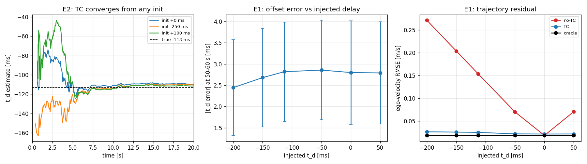
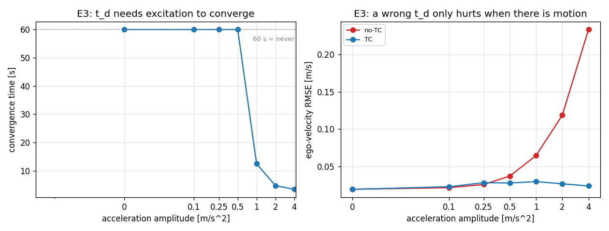
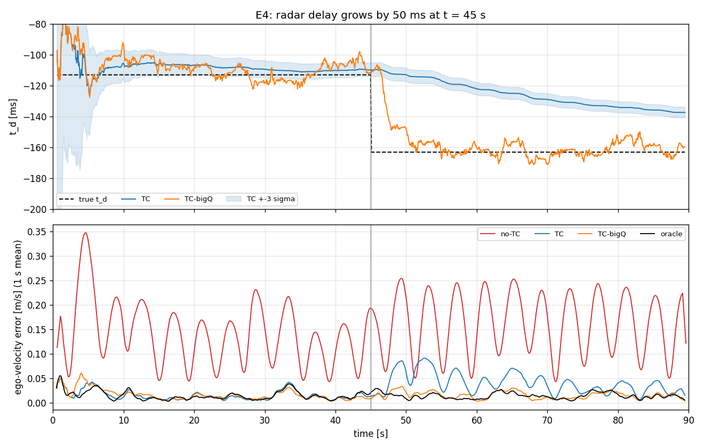
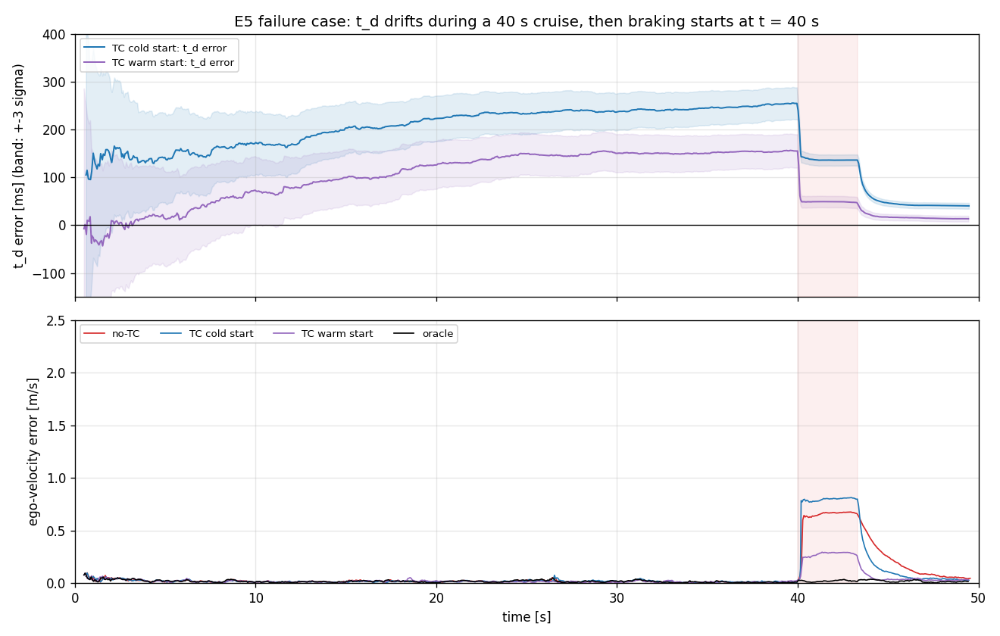

# T4 — Ước lượng độ lệch thời gian online cho radar-IMU (EKF-RIO-TC)

> Mini project Day 4, Track 4 (Sensor Reality Sprint), chủ đề **T4: Time sync / motion compensation**. Bài báo được chọn: **EKF-RIO-TC** (Kim et al., IEEE RA-L 2025). README này là báo cáo chung của nhóm. Nội dung gồm: tóm tắt bài báo, benchmark mô phỏng do nhóm tự cài đặt, kết quả và limitation của phương pháp, failure thực tế (ảnh hưởng của trễ radar tới vị trí mục tiêu và vận tốc ego), và một đề xuất cải tiến (Phần E, chưa cài đặt).

## Thành viên và báo cáo riêng

Danh sách đầy đủ ở [`TEAMMATES.md`](TEAMMATES.md). Mỗi thành viên có một báo cáo riêng theo mẫu 5 mục (Problem, Method, Benchmark, Failure case, Engineering decision) trong thư mục [`reports/`](reports/).

| Họ và tên | MSSV | Phân công | Báo cáo riêng |
| --- | --- | --- | --- |
| Đào Quang Thái Anh | 2A202602987 | Benchmark và trình bày | |
| Văn Quốc Dũng | 2A202602505 | Code | [`reports/2A202602505_VanQuocDung.md`](reports/2A202602505_VanQuocDung.md) |
| Lương Sỹ Khánh | 2A202602715 | Research | |

## Cách chạy lại

Chỉ cần Python 3 với numpy và matplotlib. Môi trường nhóm đã chạy: Python 3.10.11, numpy 2.2.6, matplotlib 3.10.9.

```bash
pip install numpy matplotlib
python rio_tc_sim.py          # E1-E6, khoảng 8 phút (log ghi 458 s); seed 0-9, E6 seed 0-19
python position_error.py      # E7: timeline, sai số vị trí trước/sau khi bù, khoảng 40 s
python export_failure_log.py  # log từng scan của kịch bản phanh gấp, khoảng 10 s
python plot_delay_impact.py   # hình 5, dùng kết quả có sẵn, không chạy lại mô phỏng
python check_claims.py        # kiểm tra Jacobian và ảnh hưởng tần số IMU, khoảng 30 s
```

**Dữ liệu:** tổng hợp hoàn toàn, sinh trong `rio_tc_sim.py`; không dùng dataset ngoài.  
**Phiên bản code:** commit [`1afade6`](https://github.com/vvstdung89/K4-Track4-Day04-Studio.h-Sensor-Reality-Sprint/commit/1afade6). Mọi bảng và hình trong `results/` được sinh từ phiên bản này.  
**Nguồn:** bài báo [arXiv 2502.00661v2](https://arxiv.org/abs/2502.00661v2) (phiên bản v2, ngày 10/06/2025) và repo [spearwin/EKF-RIO-TC](https://github.com/spearwin/EKF-RIO-TC). Code gốc của bài báo *không* được chạy: repo cần C++/ROS Noetic (Ubuntu 20.04), catkin và dữ liệu rosbag, không khả thi trên máy Windows trong 120 phút lab. Vì vậy nhóm tự cài đặt lại bản 2-D và benchmark trên dữ liệu mô phỏng, như đề lab cho phép.

## Cấu trúc thư mục

| File | Nội dung |
| --- | --- |
| `README.md` | báo cáo chung của nhóm (file này) |
| `TEAMMATES.md` | họ tên, MSSV và phân công của các thành viên |
| `reports/` | báo cáo riêng của từng thành viên |
| `rio_tc_sim.py` | mô phỏng + EKF-RIO-TC 2-D + thí nghiệm E1-E6 (chỉ cần numpy, matplotlib) |
| `position_error.py` → `results/position_error.md`, `results/fig6_timeline_position_error.png` | E7, benchmark tối thiểu của T4: timeline multi-sensor, sai số vị trí = tốc độ × độ trễ, trước/sau khi bù, ngưỡng nguy hiểm |
| `export_failure_log.py` → `results/e5_failure_log_seed1.csv`, `results/e5_failure_log_excerpt.txt` | log từng scan của kịch bản phanh gấp E5 (cùng lần chạy với hình 4) |
| `plot_delay_impact.py` → `results/fig5_delay_impact.png` | hình failure thực tế: ảnh hưởng của trễ radar tới vận tốc ego |
| `check_claims.py` → `results/check_claims.txt` | kiểm tra phụ: Jacobian bằng sai phân hữu hạn, ảnh hưởng tần số IMU (B1, C1) |
| `results/results.md` | bảng số liệu E1-E6 sinh tự động |
| `results/fig1..fig6_*.png` | hình minh họa |
| `results/run_log.txt` | log chạy |

## Tóm tắt (pitch 3-5 phút)

| | |
| --- | --- |
| **Problem** | ADAS dùng radar 4D + IMU để ước lượng vận tốc ego/odometry (đầu vào cho AEB, ACC). Radar gán timestamp lúc nhận nên trễ so với IMU; *bài báo đo được* khoảng −113 ms với TI AWR1843BOOST. |
| **Method** | EKF-RIO-TC (Kim et al., RA-L 2025): đưa độ trễ `t_d` vào trạng thái EKF và ước lượng nó cùng với hướng, vận tốc, bias. Đầu vào: IMU và vận tốc ego từ radar; đầu ra: `t̂_d`, vận tốc ego, quỹ đạo. Nhóm cài lại bản 2-D (`rio_tc_sim.py`), không chạy repo gốc. **Limitation:** chỉ hội tụ khi gia tốc từ khoảng 1 m/s²; chạy đều 40 s thì `t̂_d` trôi 320 ms (σ báo 6,7 ms) nên lúc phanh sai 1,03 m/s, tệ hơn cả không bù; không theo kịp khi độ trễ đổi giữa chuyến. |
| **Benchmark** (nhóm tự đo, mô phỏng, 10 seed) | Trễ −113 ms: offset error còn 2,8 ms, hội tụ sau 5,7 s; sai số vận tốc ego 0,154 → 0,025 m/s (oracle 0,018); RPE 10 m 0,196 → 0,047 m; ghost-rate proxy 46 % → 1,3 %; sai số vị trí mục tiêu 1,31 → 0,03 m. Trên đường thẳng, sai số vị trí đúng bằng tốc độ × độ trễ (E7). |
| **Failure case** (ảnh hưởng của trễ radar tới tính năng) | Ở 25 m/s, mục tiêu radar bị đặt sai 2,8 m ngay cả khi chạy đều, hơn nửa làn đường; muốn sai < 0,5 m thì độ trễ còn lại phải < 20 ms. Với vận tốc ego, trễ 113 ms không được bù thì vô hại khi chạy đều (0,018 m/s, bằng oracle), nhưng lúc AEB phanh −6 m/s², vận tốc ego sai 0,64 m/s RMSE, đỉnh 0,73 m/s (≈ 6 × 0,113), mà gating chỉ loại 13 % scan. Trong phố, 46 % scan bị loại như "ma". |
| **Engineering decision** | Phải bù trễ, nhưng chỉ cho `t_d` học khi kích thích đo bằng radar đủ lớn; ngoài lúc đó giữ nguyên `t̂_d` và σ_td; fallback về `t_d` hiệu chỉnh offline. Mục tiêu: sai số vận tốc khi phanh ≤ 0,05 m/s. |

---

# Phần A — Bài báo được chọn

**Kim, Bae, Shin, Wang, Oh, "EKF-Based Radar-Inertial Odometry with Online Temporal Calibration", IEEE Robotics and Automation Letters 10(7), 7230-7237, 2025.** [arXiv 2502.00661](https://arxiv.org/abs/2502.00661) · code [EKF-RIO-TC](https://github.com/spearwin/EKF-RIO-TC) (C++, ROS Noetic, GPLv3, kèm dữ liệu).

Lý do chọn: có code và dữ liệu công khai, dùng EKF (nối thẳng sang Day 5), và báo cáo metric offset error rõ ràng.

## A1. Bài toán: cảm biến bị lệch thời gian

Khi một phép đo được gán timestamp sai, bộ lọc ghép phép đo cũ với trạng thái của một thời điểm khác, nên sai số xấp xỉ bằng `tốc độ thay đổi của đại lượng đo × t_d`. Sai số này có hướng, tăng theo chuyển động và không tự triệt tiêu khi lấy trung bình.

- **Định nghĩa.** IMU là đồng hồ chuẩn (trễ < 5 ms). Phép đo radar mang timestamp `t` thực ra mô tả trạng thái tại `t + t_d`. Cần ước lượng `t_d`.
- **Vì sao radar lệch nhiều.** Trước khi có danh sách điểm, radar chạy FFT, beamforming, phát hiện mục tiêu, ước lượng góc ngẩng, rồi truyền dữ liệu. Nếu driver gán timestamp lúc *nhận* thay vì lúc *đo*, toàn bộ trễ này thành `t_d`.

| Cặp cảm biến (số liệu trong bài báo) | `t_d` điển hình |
| --- | --- |
| Radar - IMU | −113 ms |
| Camera - IMU | −47 ms |
| LiDAR - IMU | −6 ms |

- **Ý nghĩa cho ADAS.** Với `t_d` = 113 ms, một xe đi 20 m/s bị đặt sai khoảng 2,3 m. Với vận tốc ego, xe phanh −6 m/s² thì vận tốc đo bị lệch 6 × 0,113 ≈ 0,68 m/s.
- **Vì sao không chỉ dùng đồng bộ phần cứng.** Nhiều module radar không có chân trigger; ngay cả với PTP/PPS, trễ xử lý bên trong cảm biến vẫn chưa biết. Vì vậy cần **ước lượng** `t_d` từ dữ liệu.

## A2. Phương pháp: đưa `t_d` vào trạng thái EKF

1. **Trạng thái** (error-state EKF): hướng, bias con quay, vận tốc, bias gia tốc, vị trí và một số vô hướng `t_d`, mô hình hằng số (`ṫ_d = 0`) cộng nhiễu quá trình nhỏ.
2. **Phép đo:** vận tốc ego `v_R` của radar từ một scan. Mỗi điểm tĩnh cho Doppler `v_d,i = −(p_i/‖p_i‖)ᵀ v_R`; RANSAC 3 điểm + bình phương tối thiểu giải ra `v_R` và loại điểm động/điểm ma.
3. **Mô hình đo, đánh giá tại thời điểm đã bù** `t' = t + t̂_d`:
   `v̂_R(t') = R_I^R [ R_IGᵀ(t') v_IG(t') + (ω_m(t') − b_g) × p_R^I ]`, residual `r = v_R^meas(t) − v̂_R(t + t̂_d)`.
4. **Jacobian theo `t_d`** = đạo hàm theo thời gian của phép đo:
   `H_td = H_q (ω_m − b̂_g) + H_v [ R̂_IG (a_m − b̂_a) + g ]`.
   Khi không có gia tốc và vận tốc góc, `H_td ≈ 0` nên `t_d` không quan sát được.
5. **Vòng lặp mỗi scan:** IMU lan truyền tới `t + t̂_d` → RANSAC cho `v_R` → residual và Jacobian (có cột `H_td`) → một bước Kalman sửa đồng thời pose, vận tốc, bias và `t_d`.

**Liên hệ với tracker camera-LiDAR của lab T4.** Cùng một quy tắc: cột Jacobian của `t_d` là tốc độ thay đổi của đại lượng đo. Tracker đo vị trí nên cột đó là `−v` (`z ≈ p − v·t_d`, Li & Mourikis 2014); radar odometry đo vận tốc nên cột đó là gia tốc và vận tốc góc.

## A3. Benchmark của bài báo

| Bộ dữ liệu | Cảm biến | Đồng bộ phần cứng | Ground truth | Số chuỗi | Dùng để |
| --- | --- | --- | --- | --- | --- |
| Mô phỏng Gazebo (drone ảo) | radar + IMU ảo | không; chèn sẵn −150 ms | chính xác | – | kiểm tra khôi phục `t_d`, ảnh hưởng nhiễu |
| Tự thu (cầm tay, trong nhà) | TI AWR1843BOOST + Xsens MTi-670 | không | motion capture | 7 | kết quả chính |
| ICINS2021 (Doer & Trommer) | TI IWR6843AOP + ADIS16448 | có | VI-SLAM có loop closure | 4 | **chèn trễ nhân tạo** để đo offset error |
| ColoRadar (Kramer et al. 2022) | TI AWR1843BOOST + 3DM-GX5-25 | không | LiDAR-inertial SLAM | 4 | kiểm tra tổng quát |

**Giao thức chèn trễ:** lấy dữ liệu đã đồng bộ (ICINS, `t_d` thật ≈ 0) → cộng một độ trễ biết trước vào timestamp radar → chạy bộ lọc từ nhiều giá trị khởi tạo → so `t̂_d` với độ trễ đã chèn.

| Metric | Định nghĩa | Đơn vị |
| --- | --- | --- |
| Offset error `e_td` | \|`t_d` thật − `t̂_d`\| sau hội tụ | ms |
| Hội tụ / ổn định | đường `t̂_d(t)` từ nhiều giá trị khởi tạo, độ lệch chuẩn sau hội tụ | ms |
| APE (RMSE) | sai số pose tuyệt đối sau khi căn quỹ đạo (evo) | m, ° |
| RPE (RMSE) | sai số pose tương đối trên đoạn 10 m | m, ° |

Baseline: EKF-RIO gốc (Doer & Trommer 2020), cùng mô hình đo và tham số, không có `t_d`.

## A4. Kết quả của bài báo

| Kết quả | Giá trị | Dữ liệu |
| --- | --- | --- |
| `t̂_d` sau hội tụ | −113 ± 2 ms, từ nhiều giá trị khởi tạo | tự thu, 7 chuỗi |
| Offset error trung bình | khoảng 15 ms | ICINS + trễ nhân tạo |
| APE tịnh tiến / quay | giảm 56 % / 75 % so với EKF-RIO | tự thu |
| RPE tịnh tiến / quay | giảm 50 % / 57 % | tự thu |
| RPE tịnh tiến | giảm 33 % (ít chuyển động quay hơn) | ColoRadar |
| APE, RPE | ngang baseline (vốn đã đồng bộ) | ICINS gốc |

Bài báo tự nêu hai hạn chế: `t_d` **không xác định được khi đứng yên** và hội tụ chậm khi chuyển động nhẹ; nhiễu quá trình lớn thì hội tụ nhanh nhưng dao động, nhỏ thì ổn định nhưng chậm. Bài mới hơn [LC-RIO-ET](https://arxiv.org/html/2603.19958) (03/2026, factor graph + B-spline) tốt hơn 18,3 % về RPE trên cùng dữ liệu nhưng phức tạp hơn nhiều.

---

# Phần B — Benchmark mô phỏng của nhóm

Mục tiêu: tái hiện ý tưởng của bài báo trong một mô phỏng nhỏ, đo đúng 3 metric của T4 (**offset error, ghost rate, trajectory residual**), rồi tìm điều kiện làm phương pháp thất bại.

## B1. Thiết lập

**Xe và cảm biến** (mặt phẳng 2-D, không trượt ngang):

| Thành phần | Giá trị |
| --- | --- |
| IMU | 200 Hz; nhiễu 0,10 m/s² và 0,005 rad/s mỗi mẫu; bias gia tốc (0,08; −0,05) m/s², bias gyro 0,003 rad/s |
| Radar ego-velocity | 15 Hz; nhiễu 0,05 m/s mỗi trục (coi như đầu ra RANSAC, không mô phỏng outlier); gắn ở cản trước, cách IMU 3,5 m |
| Độ lệch thật | `t_d` = −113 ms (giá trị của bài báo) nếu không nói khác |

**Bộ lọc:** EKF error-state với trạng thái `[θ, b_g, v_x, v_y, b_ax, b_ay, t_d]`, mô hình đo và cột `H_td = H_θ·ω + H_v·R·a` đúng như bài báo (bản 2-D, không có trọng lực). Jacobian được kiểm bằng sai phân hữu hạn (sai khác ≤ 1e-9, `results/check_claims.txt`). Vị trí được tích phân từ vận tốc bên ngoài bộ lọc: radar ego-velocity không quan sát vị trí, và để vị trí trong trạng thái chỉ làm EKF dịch vị trí theo thông tin yaw giả (lỗi nhất quán yaw đã biết của EKF), làm nhiễu RPE.

**Phương pháp so sánh:**

| Tên | Mô tả |
| --- | --- |
| no-TC | EKF-RIO baseline: `t_d` = 0, radar dùng timestamp lúc nhận |
| **TC** | **bài báo**: `t_d` trong trạng thái, random walk nhỏ 0,1 ms/√s |
| TC-bigQ | bài báo với random walk của `t_d` lớn gấp 50 lần (thử đánh đổi hội tụ/ổn định mà bài báo nêu) |
| oracle | biết `t_d` thật (cận trên) |

**Metric:**

| Metric T4 | Cài đặt trong benchmark | Đơn vị |
| --- | --- | --- |
| Offset error | \|`t̂_d` − `t_d`\|; thời gian hội tụ = từ lúc sai số < 10 ms mãi về sau | ms, s |
| Ghost rate (proxy) | **gate-fail rate**: tỉ lệ scan radar có NIS > χ²₂(99 %) = 9,21, tức là scan một bộ gating thực tế sẽ loại như "ma" | % |
| Trajectory residual | sai số vận tốc ego trong hệ xe; RPE trên đoạn 10 m (như bài báo); APE sau căn SE(2) | m/s, m |

**Các thí nghiệm:**

| ID | Mục đích | Kịch bản |
| --- | --- | --- |
| E1 | tái hiện giao thức chèn trễ của bài báo | `t_d` ∈ {−200, −150, −113, −50, 0, +50} ms; chuyển động "city" 60 s (gia tốc ±2,4 m/s², yaw rate ±0,25 rad/s) |
| E2 | hội tụ từ nhiều giá trị khởi tạo (giống Hình 5 bài báo) | khởi tạo 0, −250, +100 ms |
| E3 | **mở rộng benchmark**: cần bao nhiêu kích thích | biên độ gia tốc 0 … 4 m/s² |
| E4 | `t_d` thay đổi giữa chuyến | `t_d` nhảy −113 → −163 ms tại t = 45 s |
| E5 | **failure case ADAS** | chạy thẳng đều 25 m/s trong 40 s, rồi phanh −6 m/s² xuống 5 m/s |
| E6 | tìm nguyên nhân của E5 | tắt lần lượt nhiễu gyro, nhiễu gia tốc, cánh tay đòn |
| E7 | **benchmark tối thiểu của T4**: sai số vị trí mục tiêu | mục tiêu tĩnh cách 30 m; đường thẳng 5-30 m/s với trễ 50-200 ms; kịch bản phố (E1) và cao tốc-phanh (E5); trước/sau khi bù |

## B2. Khác biệt so với bài báo (giới hạn của benchmark)

- 2-D thay vì 3-D, không có trọng lực; không mô phỏng điểm Doppler và RANSAC, chỉ mô phỏng đầu ra `v_R` có nhiễu Gauss.
- Dữ liệu mô phỏng, không có lỗi thực tế như nhiễu không Gauss, rung, sai ngoại tham số.
- IMU tích phân giữ mẫu (zero-order hold) ở 200 Hz, nên trạng thái trễ khoảng nửa chu kỳ IMU (2,5 ms); `t̂_d` hấp thụ phần lớn độ trễ này (xem C1).

---

# Phần C — Kết quả và phân tích

Bảng đầy đủ: [`results/results.md`](results/results.md). Số liệu dưới đây là trung bình 10 seed (E6: 20 seed).

## C1. Tái hiện bài báo: chèn trễ và hội tụ (E1, E2)



| `t_d` chèn [ms] | TC offset error [ms] | TC hội tụ [s] | gate-fail no-TC / TC / oracle | vận tốc ego RMSE no-TC / TC / oracle [m/s] | RPE 10 m no-TC / TC / oracle [m] |
| --- | --- | --- | --- | --- | --- |
| −200 | 2,45 ± 1,12 | 4,9 | 72,7 % / 1,4 % / 1,2 % | 0,271 / 0,026 / 0,018 | 0,324 / 0,047 / 0,044 |
| −150 | 2,68 ± 1,16 | 5,4 | 61,2 % / 1,3 % / 1,2 % | 0,204 / 0,026 / 0,018 | 0,251 / 0,048 / 0,044 |
| **−113** | **2,82 ± 1,16** | **5,7** | **46,0 % / 1,3 % / 1,2 %** | **0,154 / 0,025 / 0,018** | **0,196 / 0,047 / 0,044** |
| −50 | 2,86 ± 1,17 | 5,7 | 7,7 % / 1,3 % / 1,2 % | 0,070 / 0,022 / 0,018 | 0,102 / 0,045 / 0,044 |
| 0 | 2,80 ± 1,22 | 5,6 | 1,2 % / 1,3 % / 1,2 % | 0,018 / 0,021 / 0,018 | 0,044 / 0,046 / 0,044 |
| +50 | 2,79 ± 1,20 | 5,7 | 10,0 % / 1,3 % / 1,2 % | 0,071 / 0,021 / 0,018 | 0,174 / 0,046 / 0,044 |

**Phân tích**

- **Nhóm quan sát được:** với mọi độ trễ chèn vào, TC đưa vận tốc ego và RPE về sát oracle; ở −113 ms, RPE 10 m giảm 76 % (0,196 → 0,047 m) và APE giảm 57 % (4,22 → 1,81 m). **Bài báo cho biết** APE tịnh tiến giảm 56 % và RPE tịnh tiến giảm 50 % trên 7 chuỗi tự thu. Hai cặp số khác dữ liệu (mô phỏng 2-D so với dữ liệu thật) nên chỉ so được xu hướng, không so trực tiếp; mức giảm của nhóm lớn hơn được kỳ vọng vì mô phỏng có kích thích mạnh liên tục và không có nguồn lỗi nào khác.
- **Offset error không phụ thuộc độ trễ** (2,5-2,9 ms ở mọi mức), và hội tụ về cùng một giá trị từ khởi tạo 0, −250 hay +100 ms (E2, seed 0: −110,4 đến −110,9 ms, hội tụ sau 3,9-5,6 s), giống Hình 5 của bài báo. Bài báo đo khoảng 15 ms trên dữ liệu thật; mô phỏng của ta lý tưởng hơn nhiều.
- **Sai số còn lại khoảng +2,8 ms (có dấu, trung bình 50-60 s, 10 seed) chủ yếu do cách tích phân IMU**, không phải do phương pháp: IMU giữ mẫu ở 200 Hz làm trạng thái trễ nửa chu kỳ (2,5 ms). Tăng IMU lên 400 Hz (nửa chu kỳ 1,25 ms) thì sai số giảm còn +1,4 ms (`check_claims.py`).
- **Thêm `t_d` vào trạng thái là an toàn**: khi trễ thật bằng 0, TC gần như bằng no-TC (RPE 0,046 so với 0,044 m), giống kết quả của bài báo trên ICINS gốc.
- **Ghost rate (proxy):** nếu không hiệu chỉnh, 46 % scan radar ở −113 ms có residual vượt ngưỡng χ² 99 %, tức là một bộ gating sẽ coi gần nửa số scan là outlier/ma và bỏ đi. TC đưa tỉ lệ này về 1,3 %, bằng oracle.

## C2. Mở rộng benchmark: cần bao nhiêu kích thích? (E3)

Bài báo chỉ nói định tính rằng chuỗi có nhiều chuyển động quay thì cải thiện nhiều hơn. E3 đo trực tiếp: giữ `t_d` = −113 ms, thay đổi biên độ gia tốc.



| Biên độ gia tốc [m/s²] | TC hội tụ [s] | số lần hội tụ | offset error lúc 50-60 s [ms] | σ_td bộ lọc báo [ms] | vận tốc ego RMSE no-TC / TC [m/s] |
| --- | --- | --- | --- | --- | --- |
| 0 | không | 0/10 | **318** | **10,6** | 0,019 / 0,019 |
| 0,1 | không | 0/10 | 191 | 9,9 | 0,021 / 0,023 |
| 0,25 | không | 0/10 | 80 | 7,6 | 0,026 / 0,028 |
| 0,5 | không | 1/10 | 18 | 4,9 | 0,037 / 0,028 |
| 1 | 12,5 | 10/10 | 6,0 | 2,7 | 0,065 / 0,030 |
| 2 | 4,7 | 10/10 | 3,2 | 1,4 | 0,119 / 0,027 |
| 4 | 3,4 | 10/10 | 2,7 | 0,8 | 0,233 / 0,024 |

**Phân tích**

- **Ngưỡng kích thích:** cần biên độ gia tốc khoảng ≥ 1 m/s² để `t_d` hội tụ trong vòng 60 s. Phanh/tăng tốc trong phố đạt mức này; chạy cao tốc đều thì không.
- **Khi không quan sát được thì cũng chưa gây hại ngay:** dưới 0,25 m/s², no-TC và TC có sai số vận tốc như nhau, vì nếu đại lượng đo không đổi thì dịch thời gian không làm sai gì.
- **Nhưng có một vấn đề ẩn:** ở gia tốc 0, `t̂_d` không đứng yên ở giá trị khởi tạo như bài báo ngụ ý ("không xác định được khi đứng yên"). Nó **trôi đi 318 ms trong khi bộ lọc báo σ = 10,6 ms**, tức là sai 30σ. Bộ lọc vừa sai vừa tự tin. Hệ quả của vấn đề này được phân tích ở mục C4.

## C3. `t_d` thay đổi giữa chuyến (E4)

Bài báo giả định `t_d` hằng số. Thực tế trễ radar có thể đổi khi tải CPU, hàng đợi driver hoặc chế độ radar thay đổi. E4 cho trễ tăng thêm 50 ms tại t = 45 s.



| Phương pháp | dao động `t̂_d` trước bước nhảy [ms] | thời gian về < 10 ms sau bước nhảy [s] | nhất quán 3σ sau bước nhảy | vận tốc ego RMSE trước / sau [m/s] | RPE 10 m sau [m] | gate-fail sau |
| --- | --- | --- | --- | --- | --- | --- |
| no-TC | – | – | – | 0,137 / 0,178 | 0,225 | 69,2 % |
| TC (bài báo) | **0,73** | **không bao giờ** (0/10) | **0 %** | 0,016 / 0,055 | 0,114 | 6,2 % |
| TC-bigQ | 4,19 | 5,6 (10/10) | 85 % | 0,016 / 0,019 | 0,040 | 1,3 % |
| oracle | – | – | – | 0,016 / 0,015 | 0,036 | 1,4 % |

**Phân tích:** với nhiễu quá trình nhỏ, sau khi hội tụ σ_td co về khoảng 1 ms nên bộ lọc coi bước nhảy 50 ms là không thể xảy ra. `t̂_d` bò chậm (còn sai khoảng 27 ms ở cuối chuỗi, 40-45 s sau bước nhảy), sai số vận tốc tăng 3,4 lần, và dải ±3σ không bao giờ chứa giá trị thật. Tăng nhiễu quá trình 50 lần (TC-bigQ) thì bám được sau 5,6 s, nhưng `t̂_d` dao động gấp 5,7 lần khi trễ không đổi. Đây đúng là đánh đổi mà bài báo đã nêu, nay được đo bằng số; một giá trị nhiễu cố định không cho được cả hai.

## C4. Limitation của phương pháp: TC trôi khi chạy đều và tệ hơn không bù (E5, E6)

Cùng kịch bản với Phần D: xe chạy cao tốc 25 m/s thẳng đều trong 40 s, rồi phanh −6 m/s² xuống 5 m/s; `t_d` thật = −113 ms, không đổi. Phần D xét ảnh hưởng của độ trễ khi *không* bù; mục này xét phương pháp của bài báo trong cùng tình huống.



*Hình 4 là một lần chạy (seed 1); bảng dưới là trung bình 10 seed. Ở seed 1, TC khởi tạo đúng tốt hơn no-TC khi phanh (0,26 so với 0,62 m/s), nhưng trung bình 10 seed thì tệ hơn. Log từng scan của lần chạy này: [`results/e5_failure_log_seed1.csv`](results/e5_failure_log_seed1.csv), bản trích: [`results/e5_failure_log_excerpt.txt`](results/e5_failure_log_excerpt.txt).*

| Phương pháp | sai số `t_d` lúc bắt đầu phanh [ms] | σ_td bộ lọc báo [ms] | vận tốc ego RMSE khi chạy đều [m/s] | **vận tốc ego RMSE khi phanh [m/s]** | sai số đỉnh khi phanh [m/s] | gate-fail khi phanh |
| --- | --- | --- | --- | --- | --- | --- |
| no-TC | 113 | – | 0,018 | 0,639 | 0,73 | 13 % |
| **TC, khởi tạo 0** | **320** | **6,7** | 0,018 | **1,028** | 1,25 | 28 % |
| TC, khởi tạo đúng −113 ms | 224 | 7,0 | 0,018 | 0,731 | 0,90 | 22 % |
| oracle | 0 | – | 0,018 | 0,018 | 0,03 | 1 % |

**Điều gì xảy ra**

1. Trong 40 s chạy đều, `t̂_d` trôi dần ra xa giá trị thật (hình trên), còn σ_td co từ 100 ms xuống 7 ms. Lúc bắt đầu phanh, sai số là 320 ms, gấp khoảng 48 lần σ mà bộ lọc báo.
2. Khi phanh, kích thích thật xuất hiện, nhưng bộ lọc tin vào `t̂_d` sai (σ nhỏ) nên chỉ sửa được một phần: với khởi tạo 0, `t̂_d` vẫn sai trung bình khoảng 190 ms (10 seed) trong 3,3 s phanh.
3. Kết quả: sai số vận tốc ego khi phanh là 1,03 m/s, **cao hơn 61 % so với không hiệu chỉnh**. Ngay cả khi khởi tạo đúng −113 ms, `t̂_d` vẫn trôi 224 ms và vẫn tệ hơn no-TC. Khởi tạo tốt không cứu được.
4. **Không có dấu hiệu báo trước:** trong lúc chạy đều, mọi phương pháp có cùng sai số vận tốc (0,018 m/s) và residual bình thường. Lỗi chỉ lộ ra đúng lúc phanh, lúc AEB cần vận tốc ego chính xác nhất. Ngay cả lúc đó residual cũng ít báo động: trong log seed 1, sai số vận tốc ≈ 0,8 m/s nhưng NIS phần lớn dưới ngưỡng 9,21, chỉ 12 % scan lúc phanh bị gate loại, vì bộ lọc khớp vận tốc với phép đo radar đã lệch thời gian.

**Nguyên nhân (ablation E6, 20 seed, sai số `t_d` lúc bắt đầu phanh)**

| Cấu hình | sai số `t_d` trung bình [ms] | độ phân tán [ms] | σ_td bộ lọc báo [ms] | \|sai số\| / σ | vận tốc ego RMSE khi phanh [m/s] |
| --- | --- | --- | --- | --- | --- |
| mặc định | +313 | 72 | 6,9 | 45,6 | 1,079 |
| nhiễu gyro = 0 | +107 | 90 | 7,5 | 15,4 | 0,230 |
| cánh tay đòn radar = 0 | +89 | 68 | 7,0 | 12,6 | 0,210 |
| nhiễu gia tốc = 0 | +549 | 96 | 7,7 | 72,1 | 1,903 |
| mọi nhiễu IMU = 0 (giữ bias) | +73 | 72 | 8,7 | 8,6 | 0,095 |

Hai cơ chế, cả hai đến từ việc `H_td` được tính bằng **phép đo IMU thô** `ω_m − b̂_g` và `a_m − b̂_a` (đúng công thức của bài báo):

- **Quan sát được giả (false observability).** Khi xe không tăng tốc hay quay, `H_td` lẽ ra bằng 0. Nhưng IMU đo được nhiễu và phần bias chưa ước lượng đúng, nên `H_td` khác 0. EKF coi đó là kích thích thật, tích lũy "thông tin" về `t_d` và thu nhỏ σ_td, dù dữ liệu không chứa thông tin gì. Ở mọi cấu hình, kể cả không nhiễu, sai số thật vẫn lớn gấp 9-72 lần σ mà bộ lọc báo.
- **Nhiễu tương quan đẩy `t_d` về một phía.** Cùng một mẫu gyro `ω_m(t')` đi vào cả dự đoán phép đo (qua thành phần cánh tay đòn `ω × p_R`, 3,5 m) lẫn `H_td` (qua `H_θ·ω ≈ −u·ω`, u = 25 m/s). Nhiễu trong residual và nhiễu trong Jacobian tương quan với nhau, nên bước cập nhật `t_d` có kỳ vọng khác 0 và mỗi scan đẩy `t_d` cùng một hướng. Tắt nhiễu gyro hoặc bỏ cánh tay đòn giảm độ trôi khoảng 3 lần. Bỏ nhiễu gia tốc lại làm trôi mạnh hơn (+549 ms), vì khi đó thành phần gyro tương quan chiếm toàn bộ `H_td`.

**So với bài báo.** *Bài báo cho biết* `t_d` "cannot be determined while the platform is stationary", tức là chỉ nói `t_d` "không xác định được khi đứng yên" và hội tụ chậm khi chuyển động nhẹ. *Nhóm quan sát được* (mô phỏng) tình huống xấu hơn: `t_d` không đứng yên mà trôi đi, và hiệp phương sai báo sai độ tin cậy. *Giả thuyết (chưa kiểm chứng):* dữ liệu thật trong bài báo là cầm tay và drone, vốn luôn có chuyển động quay, nên vấn đề có thể không hiện ra ở đó.

**Giới hạn của kết luận:** đây là kết quả mô phỏng 2-D. Độ lớn của độ trôi phụ thuộc nhiễu gyro, cánh tay đòn và tốc độ xe. Cần kiểm chứng trên dữ liệu thật, ví dụ chạy code EKF-RIO-TC trên một chuỗi có đoạn dài đứng yên hoặc chạy đều rồi xem `t̂_d` và σ_td.

**Bài học cho kỹ sư:** σ_td do bộ lọc báo không đủ để quyết định có tin `t̂_d` hay không. Cần một tín hiệu độc lập cho biết chuyển động thật có đủ kích thích hay chưa. Đây là điểm xuất phát cho Phần E.

## C5. Sai số vị trí = tốc độ × độ trễ (E7, benchmark tối thiểu của T4)


*Hình 6 (`position_error.py`). Trái: timeline IMU/radar, radar đo ở thời điểm xanh lá nhưng được gán timestamp muộn 113 ms (đỏ); sau khi bù được ghép đúng lúc (xanh dương). Giữa: đường thẳng, đường là công thức, chấm là số đo. Phải: lái trong phố, trước và sau khi bù.*

Mục tiêu tĩnh cách 30 m được đặt vào bản đồ bằng pose thật của xe tại thời điểm hệ thống *nghĩ* là lúc đo, nên sai số chỉ đến từ lỗi thời gian. Bảng đầy đủ: [`results/position_error.md`](results/position_error.md).

- **Nhóm quan sát được:** trên đường thẳng tốc độ không đổi, sai số vị trí đúng bằng tốc độ × độ trễ ở mọi mức 5-30 m/s và 50-200 ms (ví dụ 30 m/s, 200 ms: 6,0 m).
- **Khi công thức không còn đúng:** lúc xe rẽ, mục tiêu bị xoay thêm khoảng tốc độ quay × khoảng cách × độ trễ. Trong phố, sai số đo được lớn hơn công thức khoảng 13 % (1,31 m so với 1,16 m ở trễ 113 ms).
- **Trước/sau khi bù (phố, sau 10 s đầu):** trễ 50 / 113 / 150 / 200 ms cho sai 0,58 / 1,31 / 1,74 / 2,31 m khi không bù; TC đưa về khoảng 0,03 m ở mọi mức.
- **Cao tốc 25 m/s rồi phanh (E5):** không bù thì sai 2,8 m suốt đoạn chạy đều. TC sau 40 s chạy đều sai 8,4 m ở giây cuối (khởi tạo đúng: 6,1 m), vì `t̂_d` đã trôi (mục C4).
- **Ngưỡng nguy hiểm (nhóm tự chọn):** 0,5 m (cổng ghép mục tiêu giả định) và 1,75 m (nửa làn 3,5 m). Ở 25 m/s, độ trễ còn lại phải dưới 20 ms và 70 ms tương ứng; ở 10 m/s là 50 ms và 175 ms. Trễ 113 ms vượt cả hai ngưỡng ở cao tốc.

---

# Phần D — Failure case: ảnh hưởng của trễ radar tới vị trí mục tiêu và vận tốc ego (E1, E5, E7)

Về vị trí: không bù trễ thì ở 25 m/s mục tiêu radar bị đặt sai 2,8 m ngay cả khi chạy đều, hơn nửa làn đường (mục C5). Phần dưới tập trung vào vận tốc ego, vốn chỉ sai khi xe tăng tốc hoặc phanh.

**Kịch bản ADAS (E5):** xe chạy cao tốc 25 m/s thẳng đều trong 40 s (không có kích thích), rồi AEB phanh −6 m/s² xuống 5 m/s. `t_d` thật = −113 ms và không đổi.


*Hình 5 (`plot_delay_impact.py`). Trái, giữa: E1, 10 seed, hàng no-TC là pipeline bỏ qua trễ. Phải: E5, một lần chạy (seed 1).*

- **Nhóm quan sát được:** khi chạy đều, trễ không gây sai (no-TC 0,018 m/s, bằng oracle), nên lỗi bị ẩn. Lúc phanh, no-TC sai 0,64 m/s RMSE, đỉnh 0,73 m/s, khớp dự đoán gia tốc × trễ = 0,68 m/s; vận tốc báo cao hơn thật vì là vận tốc của 113 ms trước. Sai số còn kéo dài khoảng 3 s sau khi phanh xong.
- **Gating không bắt được lỗi này:** lúc phanh chỉ 13 % scan có NIS > 9,21 (seed 1: 10 %), vì bộ lọc khớp theo phép đo đã lệch thời gian. Trong phố (E1), ngược lại, 46 % scan bị loại như "ma", RPE tăng 4,5 lần; cả hai metric tăng gần tuyến tính theo độ trễ.
- **Bài báo cho biết** trên 7 chuỗi thật, bỏ qua trễ làm APE tăng từ 0,81 m / 2,4° lên 1,82 m / 9,7°.
- **Suy luận (chưa đo):** AEB/ACC nhận vận tốc ego cao hơn thật khoảng 0,7 m/s trong lúc phanh; radar tracking trừ vận tốc ego khỏi Doppler nên vật tĩnh có thể bị gán vận tốc khoảng 0,7 m/s.

---

# Phần E — Đề xuất cải tiến: cập nhật `t_d` có nhận biết khả quan sát

> Trạng thái: **đề xuất**, chưa cài đặt. Các con số "mục tiêu" bên dưới là giả thuyết cần kiểm chứng bằng chính benchmark ở Phần B.

## E.1. Ý tưởng

Limitation ở mục C4 xảy ra vì bộ lọc luôn cập nhật `t_d` ở mọi scan, kể cả khi dữ liệu không chứa thông tin về `t_d`. Đề xuất: **chỉ cho `t_d` học khi chuyển động thật đủ kích thích, và đo kích thích bằng một tín hiệu không dùng chung nhiễu với bước cập nhật.** Ngoài các đoạn đó, `t̂_d` và σ_td được giữ nguyên, nên σ_td luôn nói thật.

Ý tưởng này lấy từ hướng nghiên cứu "observability-aware calibration":

| Nguồn | Ý chính | Phần nhóm dùng lại |
| --- | --- | --- |
| [Yang, Geneva, Zuo, Huang, T-RO 2023](https://arxiv.org/abs/2201.09170) | chỉ ra các chuyển động suy biến làm tham số hiệu chỉnh (gồm time offset) không quan sát được; mọi tham số chỉ quan sát được khi chuyển động đủ kích thích | điều kiện "không kích thích thì không học `t_d`" |
| [Schneider et al. 2019](https://arxiv.org/abs/1901.07242) | dùng metric lý thuyết thông tin để chọn các đoạn quỹ đạo giàu thông tin, chỉ hiệu chỉnh từ các đoạn đó | đo thông tin của từng cửa sổ, lưu `t_d` từ đoạn tốt cho chuyến sau |
| [OA-LICalib, Lv et al., T-RO 2022](https://arxiv.org/abs/2205.03276) | chọn dữ liệu theo thông tin, và chỉ cập nhật các hướng quan sát được của trạng thái (TSVD) | chỉ cập nhật `t_d` khi hướng đó quan sát được, dạng một tham số |

## E.2. Thuật toán

Thêm một vòng đệm 1 s (15 scan radar) và một cờ `gate` vào EKF-RIO-TC; trạng thái và mô hình đo giữ nguyên.

1. **Đo kích thích bằng radar.** Đạo hàm vận tốc ego lấy từ chính các phép đo radar trong cửa sổ, `ż ≈ (z_k − z_{k−N}) / (t_k − t_{k−N})` (dùng median để chống scan RANSAC lỗi). Tín hiệu này không chứa nhiễu hay bias của IMU, nên không lặp lại hai cơ chế ở Phần D.
2. **Tính thông tin thật về `t_d` trong cửa sổ:** `I_W = Σ_k max(‖ż_k‖² − n², 0) / σ_r²`, với `n` là mức nhiễu của `ż` (khoảng 0,07 m/s² cho cửa sổ 1 s) và `σ_r` là nhiễu radar. `σ_W = 1/√I_W` là độ chính xác `t_d` mà cửa sổ này *thật sự* có thể cho.
3. **Mở cổng** khi `σ_W < 20 ms`. Với thông số hiện tại, ngưỡng này ứng với gia tốc RMS khoảng 0,65 m/s² trong 1 s, khớp với điểm mà E3 bắt đầu hội tụ (giữa 0,5 và 1 m/s²).
4. **Cổng mở:** cập nhật như bài báo, nhưng `H_td` tính bằng IMU trung bình trên khoảng 50 ms quanh `t'` thay vì một mẫu thô. Mẫu gyro dùng trong dự đoán phép đo chỉ còn trọng số khoảng 1/10 trong `H_td`, nên đường tương quan nhiễu gần như bị cắt.
5. **Cổng đóng:** cập nhật kiểu Schmidt ("consider"): đặt hàng `t_d` của độ lợi Kalman `K` bằng 0, dùng dạng Joseph cho `P`. Khi đó `t̂_d` không đổi và σ_td không co lại, nhưng độ bất định của `t_d` vẫn nằm trong `S` nên các trạng thái khác không bị quá tự tin.
6. **Lưu giữa các chuyến:** khi một đoạn có cổng mở làm σ_td < 5 ms, lưu `t̂_d` và σ_td; chuyến sau khởi tạo từ giá trị đã lưu thay vì 0.

Chi phí thêm: một vòng đệm 15 phần tử và vài phép cộng mỗi scan; không thêm trạng thái.

## E.3. Kết quả kỳ vọng và cách kiểm chứng

Chạy lại đúng các thí nghiệm của Phần B, thêm phương pháp "TC-OA". Tiêu chí chấp nhận:

| Kiểm tra | Bài báo (đã đo) | Mục tiêu của TC-OA | Lý do kỳ vọng |
| --- | --- | --- | --- |
| E5, khởi tạo từ giá trị đã lưu: vận tốc ego RMSE khi phanh | 0,731 m/s | ≤ 0,05 m/s (gần oracle 0,018) | cổng đóng suốt 40 s nên `t̂_d` giữ −113 ms |
| E5, khởi tạo 0: vận tốc ego RMSE khi phanh | 1,028 m/s | < 0,639 m/s (tốt hơn no-TC) | `t̂_d` giữ 0 với σ = 100 ms trung thực, nên học nhanh ngay khi phanh |
| E5: \|sai số `t_d`\| / σ lúc bắt đầu phanh | khoảng 48 | ≤ 3 | σ không co lại khi không có thông tin |
| E3, gia tốc 0: sai số `t_d` sau 60 s | 318 ms | bằng sai số khởi tạo, không trôi | cổng đóng |
| E1, −113 ms: offset error / thời gian hội tụ | 2,8 ms / 5,7 s | ≤ 3 ms / ≤ 8 s | kích thích mạnh nên cổng gần như luôn mở |
| E4 (trễ đổi giữa chuyến) | không bám được | không tệ hơn bài báo | đề xuất này không nhắm vào E4 |

## E.4. Rủi ro và giới hạn

- **Chọn ngưỡng:** ngưỡng cao làm phí các đoạn kích thích nhẹ và hội tụ chậm; ngưỡng thấp lại cho bộ lọc học từ nhiễu. Cần quét ngưỡng trên E3 và E5.
- **Không theo được `t_d` thay đổi khi cổng đóng lâu.** Nếu trễ thật đổi trong lúc chạy đều (E4), giá trị cũ vẫn được giữ. Cần kết hợp với một cơ chế phát hiện bước nhảy từ residual (ví dụ NIS trung bình trượt vượt ngưỡng thì nới σ_td), để vòng sau.
- **Đạo hàm radar phụ thuộc chất lượng RANSAC:** cảnh đông xe làm `ż` nhiễu. Median trong cửa sổ giảm được một phần; cần kiểm tra trên dữ liệu thật.
- **Vẫn là mô phỏng:** cả limitation ở C4 lẫn hiệu quả của cải tiến cần xác nhận bằng code EKF-RIO-TC trên một chuỗi thật có đoạn dài chạy đều.

---

# Tài liệu tham khảo

- Kim, Bae, Shin, Wang, Oh, ["EKF-Based Radar-Inertial Odometry with Online Temporal Calibration"](https://arxiv.org/abs/2502.00661), IEEE RA-L 10(7), 2025. Code: [EKF-RIO-TC](https://github.com/spearwin/EKF-RIO-TC).
- Štironja, Petrović, Peršić, Marković, Petrović, ["Radar-Inertial Odometry with Online Spatio-Temporal Calibration via Continuous-Time IMU Modeling" (LC-RIO-ET)](https://arxiv.org/html/2603.19958), arXiv, 03/2026.
- Doer & Trommer, EKF-RIO (baseline) và dữ liệu ICINS2021: [repo rio](https://github.com/christopherdoer/rio).
- Li & Mourikis, ["Online temporal calibration for camera-IMU systems: Theory and algorithms"](https://intra.ece.ucr.edu/~mourikis/papers/Li2014IJRR_timing.pdf), IJRR 33(7), 2014.
- Huang, Mourikis, Roumeliotis, "Observability-based Rules for Designing Consistent EKF SLAM Estimators", IJRR 29(5), 2010 (lỗi nhất quán yaw của EKF, lý do tách vị trí khỏi trạng thái ở B1).
- Grupp, [evo: Python package for the evaluation of odometry and SLAM](https://github.com/MichaelGrupp/evo).
- Yang, Geneva, Zuo, Huang, ["Online Self-Calibration for Visual-Inertial Navigation: Models, Analysis, and Degeneracy"](https://arxiv.org/abs/2201.09170), IEEE T-RO 39(5), 2023.
- Schneider, Li, Cadena, Nieto, Siegwart, ["Observability-Aware Self-Calibration of Visual and Inertial Sensors for Ego-Motion Estimation"](https://arxiv.org/abs/1901.07242), 2019.
- Lv, Zuo, Hu, Xu, Huang, Liu, ["Observability-Aware Intrinsic and Extrinsic Calibration of LiDAR-IMU Systems" (OA-LICalib)](https://arxiv.org/abs/2205.03276), IEEE T-RO 2022. Code: [OA-LICalib](https://github.com/APRIL-ZJU/OA-LICalib).
