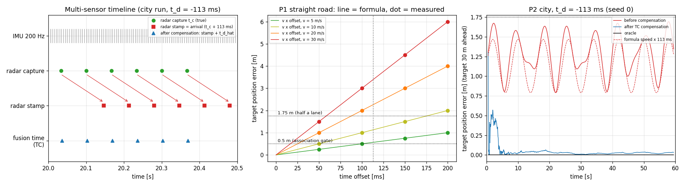
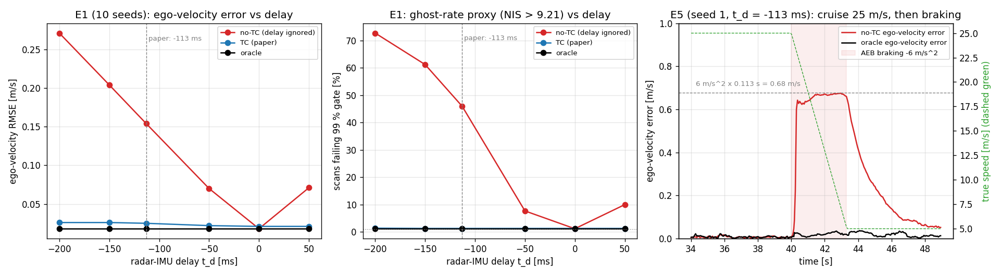

# Báo cáo cá nhân T4: Ước lượng độ trễ radar-IMU online bằng EKF-RIO-TC

**Người viết:** Văn Quốc Dũng (MSSV 2A202602505)  
**Bài thực hành:** Track 4, Ngày 4 (Sensor Reality Sprint), chủ đề T4: Time sync / motion compensation  
**Vai trò trong nhóm:** phụ trách code: cài đặt mô phỏng và EKF-RIO-TC 2-D (`rio_tc_sim.py`) cùng các script thí nghiệm. Phân công của cả nhóm ở [`TEAMMATES.md`](../TEAMMATES.md).  
**Bằng chứng chung của nhóm:** [báo cáo nhóm](../README.md) (đầy đủ các thí nghiệm), thư mục [`results/`](../results/) (bảng số, log, hình) và danh sách thành viên [`TEAMMATES.md`](../TEAMMATES.md).

Trong báo cáo, những câu bắt đầu bằng "Bài báo cho biết" là kết luận của tác giả bài báo; "Nhóm đo được" là kết quả nhóm tự chạy trong mô phỏng; những điểm chưa đo trực tiếp được ghi rõ là suy luận.

## 1. Problem

Bài toán đặt trong bối cảnh xe có hệ thống hỗ trợ lái (ADAS). Xe dùng radar 4D, loại radar đo được vận tốc tương đối của vật thể qua hiệu ứng Doppler, kết hợp với IMU. Từ hai sensor này, hệ thống ước lượng **vận tốc ego** (vận tốc của chính xe) và đặt các mục tiêu radar vào bản đồ xung quanh xe. Cả hai là đầu vào của phanh khẩn cấp tự động (AEB), ga tự động thích ứng (ACC) và radar tracking. Radar có lợi thế là vẫn hoạt động khi camera và LiDAR bị suy giảm vì sương mù, bụi hay thiếu sáng.

Lỗi thực tế mà nhóm quan tâm là **radar bị lệch thời gian so với IMU**. Trước khi xuất ra được một danh sách điểm, radar phải chạy FFT, beamforming, phát hiện mục tiêu rồi truyền dữ liệu qua mạng. Nếu driver gán timestamp lúc nhận gói tin thay vì lúc đo, toàn bộ thời gian xử lý này trở thành độ trễ. Bài báo cho biết, với radar TI AWR1843BOOST, độ trễ đo được là khoảng 113 ms. Con số này lớn hơn nhiều so với camera (47 ms) và LiDAR (6 ms) trong các hệ tương tự. Bài báo cũng cho biết cả nền tảng tự thu của tác giả lẫn bộ dữ liệu ColoRadar đều không có đồng bộ phần cứng giữa radar và IMU. Khi không có trigger, độ trễ chỉ có thể được ước lượng từ chính dữ liệu.

**Claim ban đầu của nhóm.** Khi radar trễ 50-200 ms so với IMU, vị trí mục tiêu radar sẽ sai khoảng *tốc độ × độ trễ*, còn vận tốc ego sẽ sai khoảng *gia tốc × độ trễ*. Cả hai sai số đều tăng khi độ trễ tăng. Nếu bù trễ online theo bài báo, các sai số này sẽ về gần mức không có trễ, với điều kiện xe có đủ chuyển động.

## 2. Method

Nhóm chọn bài báo của Kim và cộng sự, *EKF-Based Radar-Inertial Odometry with Online Temporal Calibration*, đăng trên IEEE Robotics and Automation Letters năm 2025 ([arXiv 2502.00661v2](https://arxiv.org/abs/2502.00661)). Phiên bản được dùng là arXiv v2 (ngày 10/06/2025), tại [arxiv.org/abs/2502.00661v2](https://arxiv.org/abs/2502.00661v2). Code của tác giả có tại [github.com/spearwin/EKF-RIO-TC](https://github.com/spearwin/EKF-RIO-TC).

**Vì sao không chạy code gốc.** Repo gốc viết bằng C++ trên ROS Noetic, cần Ubuntu 20.04, build bằng catkin và dữ liệu dạng rosbag. Máy dùng để chạy benchmark chạy Windows, và thời gian lab chỉ có 120 phút. Vì vậy nhóm chọn đường chạy mà đề lab cho phép: tự cài đặt lại ý tưởng chính ở dạng 2-D bằng Python trong file [`rio_tc_sim.py`](../rio_tc_sim.py), rồi benchmark trên dữ liệu mô phỏng. Báo cáo do đó không phụ thuộc vào một commit cụ thể của repo gốc.

**Ý tưởng thuật toán.** Phương pháp dựa trên bộ lọc Kalman mở rộng (EKF) dùng cho radar-inertial odometry. Điểm mới là độ trễ `t_d` được đưa vào trạng thái của bộ lọc, để được ước lượng cùng lúc với hướng, vận tốc và bias của IMU. Mỗi khi có một scan radar, bộ lọc tích phân IMU tới thời điểm đã hiệu chỉnh `t + t̂_d`, dự đoán vận tốc mà radar lẽ ra phải đo, rồi so với vận tốc radar thực sự đo được. Phần chênh lệch được dùng để sửa toàn bộ trạng thái, kể cả `t_d`. Mức độ chênh lệch này phụ thuộc vào `t_d` qua tốc độ thay đổi của vận tốc: xe càng tăng tốc hoặc quay mạnh thì một độ trễ nhỏ càng tạo ra sai lệch lớn, và bộ lọc càng dễ "nhìn thấy" độ trễ. Nhóm đã kiểm tra công thức đạo hàm trong code bằng sai phân hữu hạn; hai cách tính khớp nhau tới sai số dưới 1e-9 ([`results/check_claims.txt`](../results/check_claims.txt)).

**Đầu vào và đầu ra.** Đầu vào là dữ liệu IMU (gia tốc và vận tốc góc, 200 Hz trong mô phỏng của nhóm) và vận tốc ego mà radar ước lượng từ một scan (15 Hz). Đầu ra là độ trễ ước lượng `t̂_d` kèm độ bất định σ, vận tốc ego và quỹ đạo của xe.

**Giả định.** Phương pháp giả định độ trễ gần như không đổi trong suốt chuyến đi, các điểm nhiễu và vật thể chuyển động đã được RANSAC loại bỏ trước, và xe có đủ gia tốc hoặc chuyển động quay để độ trễ quan sát được.

**Metric của bài báo.** Bài báo đánh giá bằng sai số độ trễ (chênh lệch giữa độ trễ thật và độ trễ ước lượng, đo bằng cách cộng thêm một độ trễ biết trước vào dữ liệu đã được đồng bộ phần cứng), cùng với sai số quỹ đạo tuyệt đối (APE) và sai số quỹ đạo tương đối trên đoạn 10 m (RPE). Tất cả được so với EKF-RIO gốc, vốn không bù độ trễ.

**Limitation.** Bài báo cho biết độ trễ không xác định được khi xe đứng yên. Bài báo cũng nêu một đánh đổi khi chọn mức nhiễu quá trình cho `t_d`: đặt lớn thì ước lượng hội tụ nhanh nhưng dao động, đặt nhỏ thì ổn định nhưng hội tụ chậm. Benchmark của nhóm cho thấy thêm ba giới hạn:

- **Cần đủ chuyển động.** Nhóm đo được rằng độ trễ chỉ hội tụ khi biên độ gia tốc của xe từ khoảng 1 m/s² trở lên (10/10 lần chạy). Khi xe không tăng tốc, ước lượng không đứng yên mà trôi đi tới 318 ms, trong khi bộ lọc vẫn báo độ bất định chỉ khoảng 10 ms ([hình 2](../results/fig2_e3_excitation.png)). Nói cách khác, bộ lọc vừa sai vừa rất tự tin.
- **Có thể tệ hơn không bù (failure case của phương pháp, E5 và E6).**
  - Kịch bản: xe chạy thẳng đều 25 m/s trong 40 s, rồi phanh gấp −6 m/s². Độ trễ thật là −113 ms.
  - Lúc chạy đều, xe không tăng tốc, không quay. Dữ liệu không chứa thông tin về độ trễ.
  - Bộ lọc vẫn học từ nhiễu. Nó tính độ nhạy theo độ trễ từ mẫu IMU thô, nên nhiễu IMU bị hiểu nhầm thành chuyển động thật.
  - Ước lượng độ trễ trôi dần. Lúc bắt đầu phanh, nó sai 320 ms. Bộ lọc lại báo độ bất định chỉ 6,7 ms, tức là sai nhưng rất tự tin.
  - Khi phanh, sai số vận tốc ego là 1,03 m/s. Nếu không bù trễ thì chỉ sai 0,64 m/s. Phương pháp làm kết quả tệ hơn 61 %.
  - Vị trí mục tiêu radar cũng tệ hơn. Ở giây cuối của đoạn chạy đều, mục tiêu bị đặt sai 8,4 m. Nếu không bù trễ thì chỉ sai 2,8 m ([`results/position_error.md`](../results/position_error.md), phần P3).
  - Khởi tạo đúng −113 ms cũng không cứu được: sai số vận tốc vẫn là 0,73 m/s, sai số vị trí 6,1 m.
  - Nguyên nhân đã được kiểm chứng (20 seed): khi tắt nhiễu gyro trong mô phỏng, độ trôi giảm từ 313 ms xuống 107 ms.
  - Bằng chứng: [`results/results.md`](../results/results.md) (mục E5, E6) và [hình 4](../results/fig4_e5_cruise_brake_failure.png).
- **Không theo kịp khi độ trễ thay đổi.** Khi độ trễ tăng đột ngột thêm 50 ms giữa chuyến, bộ lọc không bắt kịp trong 45 s còn lại ở cả 10 lần chạy. Tăng mức nhiễu quá trình lên 50 lần thì bắt kịp sau 5,6 s, nhưng ước lượng dao động mạnh hơn 5,7 lần. Đây chính là đánh đổi mà bài báo đã nêu, nay được đo bằng số.

## 3. Benchmark

**Dữ liệu và cấu hình.** Nhóm dùng **dữ liệu tổng hợp**: một mô phỏng xe 2-D, không dùng dataset bên ngoài. Cách tạo dữ liệu nằm trong `rio_tc_sim.py`. IMU 200 Hz có nhiễu 0,10 m/s² và 0,005 rad/s mỗi mẫu, cùng bias cố định. Radar 15 Hz có nhiễu 0,05 m/s, gắn cách IMU 3,5 m. Có hai kiểu chuyển động: lái trong phố 60 s (tăng/giảm tốc ±2,4 m/s², rẽ tới 0,25 rad/s) và chạy cao tốc 25 m/s rồi phanh gấp. Mỗi con số là trung bình của 10 lần chạy với seed 0-9.

**Baseline và điều kiện lỗi.** Baseline là điều kiện **không có lệch thời gian** (`t_d` = 0). Các điều kiện lỗi chỉ thay đổi một tham số là độ trễ radar: 50, 113, 150 và 200 ms. Mọi thứ khác giữ nguyên. Với mỗi điều kiện, nhóm so sánh ba cách xử lý:

- **Không bù trễ:** pipeline như hiện nay, dùng timestamp lúc nhận.
- **Phương pháp của bài báo:** ước lượng `t_d` online.
- **Oracle:** biết trước độ trễ thật, dùng làm mức tốt nhất có thể đạt được.

**Metric.** Với mọi metric dưới đây, số càng nhỏ càng tốt.

| Metric | Cách tính | Đơn vị | Phản ánh điều gì |
| --- | --- | --- | --- |
| Sai số vị trí mục tiêu | Mục tiêu tĩnh cách 30 m được đặt vào bản đồ bằng pose của xe tại thời điểm hệ thống *nghĩ* là lúc đo. Dùng pose thật của xe để chỉ đo lỗi do thời gian | m | Ảnh hưởng tới fusion và tracking |
| Sai số vận tốc ego | RMSE giữa vận tốc ước lượng và vận tốc thật | m/s | Ảnh hưởng tới AEB/ACC |
| Tỉ lệ scan bị loại (proxy cho ghost rate) | Tỉ lệ scan có chỉ số kiểm định NIS > 9,21 (ngưỡng χ² 99 %), tức là scan mà một bộ lọc ngoại lai sẽ bỏ như "ma" | % | Sức khỏe dữ liệu radar |
| RPE 10 m | Sai số quỹ đạo tương đối trên đoạn 10 m, như bài báo | m | Chất lượng odometry |
| Sai số độ trễ | \|độ trễ ước lượng − độ trễ thật\| | ms | Chất lượng thuật toán bù trễ |

**Proxy chưa chứng minh được gì.** Tỉ lệ scan bị loại chỉ cho biết bao nhiêu scan một bộ gating sẽ bỏ. Nó không đếm số mục tiêu ma thật trong radar tracking. Sai số vị trí dùng pose thật của xe, nên chưa gồm sai số odometry. Benchmark cũng không đo trực tiếp AEB hay tracker thật sai bao nhiêu.

**Lệnh chạy.** `python rio_tc_sim.py` (khoảng 8 phút), sau đó `python position_error.py`, `python export_failure_log.py`, `python plot_delay_impact.py` và `python check_claims.py`. Môi trường: Python 3.10.11, numpy 2.2.6, matplotlib 3.10.9. Bảng số nằm ở [`results/results.md`](../results/results.md) và [`results/position_error.md`](../results/position_error.md); log chạy ở [`results/run_log.txt`](../results/run_log.txt).

### 3.1 Sai số vị trí = tốc độ × độ trễ (benchmark tối thiểu của T4)

*Hình 6 ([`results/fig6_timeline_position_error.png`](../results/fig6_timeline_position_error.png)). Trái: timeline của IMU và radar. Mỗi scan radar được đo ở thời điểm xanh lá, nhưng đến nơi và được gán timestamp muộn hơn 113 ms (đỏ). Sau khi bù, scan được ghép đúng lúc (xanh dương). Giữa: sai số vị trí trên đường thẳng; đường là công thức, chấm là số đo. Phải: sai số vị trí khi lái trong phố, trước và sau khi bù.*

**Nhóm đo được** rằng trên đường thẳng với tốc độ không đổi, sai số vị trí đúng bằng tốc độ × độ trễ, ở mọi mức từ 5 tới 30 m/s và 50 tới 200 ms. Ví dụ, 30 m/s với trễ 200 ms cho sai 6,0 m.

Công thức này không còn chính xác khi xe rẽ. Khi đó mục tiêu còn bị xoay thêm một đoạn khoảng *tốc độ quay × khoảng cách × độ trễ*. Trong phố, sai số đo được lớn hơn công thức khoảng 13 % (1,31 m so với 1,16 m ở trễ 113 ms), và chênh nhiều nhất đúng lúc xe đang rẽ.

**Bảng điều kiện — lái trong phố** (sai số vị trí lấy sau 10 s đầu; các metric khác lấy trên cả chuyến):

| Điều kiện | Cách xử lý | Sai số vị trí | Sai số vận tốc ego | Tỉ lệ scan bị loại | RPE 10 m |
| --- | --- | --- | --- | --- | --- |
| Baseline, không trễ | không bù | 0 m (theo định nghĩa) | 0,018 m/s | 1,2 % | 0,044 m |
| Trễ 50 ms | không bù | 0,58 m | 0,070 m/s | 7,7 % | 0,102 m |
| **Trễ 113 ms** | **không bù** | **1,31 m** | **0,154 m/s** | **46,0 %** | **0,196 m** |
| Trễ 150 ms | không bù | 1,74 m | 0,204 m/s | 61,2 % | 0,251 m |
| Trễ 200 ms | không bù | 2,31 m | 0,271 m/s | 72,7 % | 0,324 m |
| **Trễ 113 ms** | **phương pháp bài báo** | **0,03 m** | **0,025 m/s** | **1,3 %** | **0,047 m** |
| Trễ 113 ms | oracle | 0 m | 0,018 m/s | 1,2 % | 0,044 m |

Mọi metric xấu dần khi độ trễ tăng. Khi xe có đủ chuyển động, phương pháp của bài báo đưa mọi metric về gần mức baseline. Sai số độ trễ còn 2,8 ms, hội tụ sau 5,7 s ([hình 1](../results/fig1_e1_e2_offset_error.png)). Bài báo cho biết sai số độ trễ trên dữ liệu thật là khoảng 15 ms. Vì hai bên dùng dữ liệu khác nhau, con số này không nên so trực tiếp với 2,8 ms của nhóm.

**Giới hạn của benchmark.** Mô phỏng chỉ có 2-D. Nhóm không mô phỏng từng điểm Doppler và bước RANSAC, mà chỉ mô phỏng vận tốc ego đầu ra có nhiễu. Nhóm chưa chạy code gốc trên dữ liệu thật, và chưa làm phần mở rộng rolling-shutter của đề.

## 4. Failure case: trễ radar làm sai vị trí mục tiêu và sai vận tốc ego khi phanh gấp

**Vì sao radar bị trễ.** Như đã nói ở phần 1, radar chỉ gửi dữ liệu sau khi xử lý xong một khung, và driver gán timestamp lúc nhận. Vì vậy phép đo mà hệ thống nhận được thực chất mô tả trạng thái của 113 ms trước đó. Với vị trí, sai số bằng tốc độ × độ trễ, nên lỗi xuất hiện ngay cả khi xe chạy đều. Với vận tốc, sai số bằng gia tốc × độ trễ, nên lỗi chỉ xuất hiện khi xe tăng tốc hoặc phanh.

**Kịch bản kiểm tra.** Nhóm mô phỏng một tình huống AEB: xe chạy thẳng đều 25 m/s trên cao tốc trong 40 s, sau đó phanh gấp −6 m/s² cho tới khi còn 5 m/s. Độ trễ thật là 113 ms và **không được bù**, đúng như một pipeline chưa xử lý vấn đề này.

*Hình 5 ([`results/fig5_delay_impact.png`](../results/fig5_delay_impact.png)). Hai biểu đồ bên trái là kết quả trong phố với nhiều mức trễ (trung bình 10 seed). Biểu đồ bên phải là một lần chạy của kịch bản phanh gấp (seed 1). Log từng scan của lần chạy này ở [`results/e5_failure_log_seed1.csv`](../results/e5_failure_log_seed1.csv), bản trích quanh thời điểm phanh ở [`results/e5_failure_log_excerpt.txt`](../results/e5_failure_log_excerpt.txt).*

**Vị trí mục tiêu sai ngay cả khi chạy đều.** Nhóm đo được rằng ở 25 m/s, mục tiêu radar bị đặt sai 2,8 m trong suốt đoạn chạy đều. Con số này lớn hơn nửa làn đường (1,75 m). Một xe ở làn bên cạnh có thể bị gán vào làn của mình, hoặc ngược lại (suy luận).

**Vận tốc ego chỉ sai khi phanh, nên lỗi bị ẩn.** Khi xe chạy đều, sai số vận tốc ego khi không bù trễ chỉ là 0,018 m/s, bằng đúng oracle. Không có chỉ số vận tốc nào cho thấy hệ thống đang có vấn đề. Khi xe bắt đầu phanh, sai số nhảy lên trung bình 0,64 m/s và đạt đỉnh 0,73 m/s. Con số này khớp với ước tính 6 m/s² × 0,113 s ≈ 0,68 m/s. Vì hệ thống đang dùng vận tốc của 113 ms trước, nó luôn báo xe **chạy nhanh hơn thực tế** trong lúc phanh. Sau khi ngừng phanh, sai số còn kéo dài khoảng 3 s.

**Bộ kiểm tra ngoại lai không phát hiện được.** Trong lúc phanh, chỉ 10-13 % scan radar bị đánh dấu là bất thường. Bộ lọc đã tự chỉnh vận tốc cho khớp với phép đo bị trễ, nên chênh lệch giữa đo và dự đoán vẫn nhỏ, dù cả hai đều sai. Khi lái trong phố thì ngược lại: 46 % scan radar bị loại như "ma", tức gần nửa dữ liệu radar bị bỏ đi.

**Ngưỡng nguy hiểm.** Nhóm tự chọn hai ngưỡng sai số vị trí. Ngưỡng 0,5 m là cỡ cổng ghép mục tiêu (association gate) mà nhóm giả định cho tracker. Ngưỡng 1,75 m là nửa làn đường 3,5 m. Từ công thức sai số = tốc độ × độ trễ, độ trễ tối đa cho phép là:

| Tốc độ | Để sai < 0,5 m | Để sai < 1,75 m |
| --- | --- | --- |
| 10 m/s (trong phố) | 50 ms | 175 ms |
| 25 m/s (cao tốc) | 20 ms | 70 ms |
| 30 m/s | 17 ms | 58 ms |

Độ trễ 113 ms của radar trong bài báo vượt cả hai ngưỡng khi xe chạy cao tốc. Vì vậy, ở tốc độ cao tốc, sai lệch thời gian còn lại sau khi bù phải dưới khoảng 20 ms.

**Trên dữ liệu thật**, bài báo cho biết khi bỏ qua độ trễ, sai số quỹ đạo trung bình trên 7 chuỗi đo cầm tay (ground truth từ hệ motion capture) là 1,82 m và 9,7°. Khi bù độ trễ online, các con số này giảm còn 0,81 m và 2,4°.

**Ảnh hưởng tới tính năng (suy luận, nhóm chưa đo trực tiếp).** Trong lúc phanh khẩn cấp, AEB và ACC sẽ nhận vận tốc ego cao hơn thực tế khoảng 0,7 m/s. Radar tracking dùng vận tốc ego để trừ chuyển động của chính xe khỏi Doppler, nên một vật đứng yên có thể bị gán vận tốc khoảng 0,7 m/s và bị hiểu nhầm là đang chuyển động.

## 5. Engineering decision

Kết quả ở phần 4 cho thấy **không thể bỏ qua độ trễ của radar**. Ở cao tốc, mục tiêu bị đặt sai hơn nửa làn đường. Khi phanh gấp, vận tốc ego sai đúng lúc AEB cần nó nhất. Cơ chế kiểm tra ngoại lai thông thường lại không bắt được lỗi. Tuy nhiên, các giới hạn ở phần 2 cho thấy không nên áp dụng phương pháp của bài báo một cách mù quáng. Bảng dưới tóm tắt khi nào nên và không nên dùng:

| Tình huống | Quyết định | Căn cứ (nhóm đo được) |
| --- | --- | --- |
| Lái trong phố, thường xuyên tăng/giảm tốc hoặc rẽ (gia tốc từ 1 m/s²) | Nên dùng ước lượng online | Hội tụ sau 3-13 s; sai số vị trí giảm từ 1,31 m xuống 0,03 m; tỉ lệ scan bị loại từ 46 % xuống 1,3 % |
| Cao tốc chạy đều lâu, có khả năng phanh gấp | Không để bộ lọc tự học độ trễ | Sau 40 s chạy đều, vị trí sai 8,4 m (không bù: 2,8 m); khi phanh, vận tốc sai 1,03 m/s (không bù: 0,64 m/s) |
| Độ trễ đã đo offline và ổn định | Dùng giá trị cố định, chỉ giám sát | Dùng đúng độ trễ cho kết quả bằng oracle |
| Độ trễ thay đổi theo tải CPU hoặc chế độ radar | Cần thêm cơ chế phát hiện thay đổi | Độ trễ tăng 50 ms thì bộ lọc không theo kịp |

**Cải tiến và phương án dự phòng cho failure case (đề xuất, chưa cài đặt).** Failure ở phần 4 có hai đặc điểm: sai số xuất hiện vì độ trễ không được bù, và cơ chế kiểm tra ngoại lai không phát hiện ra nó. Vì vậy nhóm đề xuất ba lớp xử lý, mỗi lớp nhắm vào một phần của vấn đề.

1. **Luôn bù trễ, mặc định bằng giá trị hiệu chỉnh offline.** Mỗi loại radar được đo độ trễ một lần, bằng timestamp phần cứng hoặc bằng ước lượng online trên một đoạn lái có nhiều chuyển động, rồi dùng giá trị đó làm mặc định. Nhóm đo được rằng khi bù đúng độ trễ (cấu hình oracle), sai số vị trí về 0 và sai số vận tốc ego lúc phanh giảm từ 0,64 m/s xuống 0,018 m/s. Như vậy chỉ cần biết đúng độ trễ là failure này được loại bỏ; câu hỏi còn lại là lấy giá trị đó ở đâu cho đáng tin.
2. **Chỉ cho ước lượng online học khi thật sự có thông tin.** Lớp này sửa failure case của phương pháp ở phần 2.
   - Đo chuyển động bằng radar, không bằng IMU thô. Cụ thể là lấy đạo hàm vận tốc ego mà radar đo được trong cửa sổ 1 s. Tín hiệu này không mang nhiễu IMU.
   - Chỉ cập nhật độ trễ khi cửa sổ đủ thông tin để xác định nó với sai số dưới 20 ms. Mức này tương đương gia tốc khoảng 0,65 m/s², và khớp với ngưỡng nguy hiểm 20 ms ở cao tốc.
   - Khi không đủ thông tin, bộ lọc giữ nguyên ước lượng độ trễ và độ bất định (cập nhật kiểu Schmidt). Độ bất định không còn co lại sai.
   - Giá trị tốt nhất được lưu lại. Chuyến sau dùng nó làm điểm khởi đầu.
   - Nếu radar không thấy đủ chuyển động trong hơn 10 s, ước lượng online bị đánh dấu "không tin cậy". Hệ thống dùng giá trị offline ở lớp 1.
3. **Thêm một bước kiểm tra timestamp riêng**, vì kiểm tra ngoại lai thông thường không phát hiện được lỗi này. Khi xe tăng tốc hoặc phanh mạnh, hệ thống so sánh gia tốc suy ra từ vận tốc radar với gia tốc đo bởi IMU. Độ lệch thời gian giữa hai tín hiệu, tìm bằng tương quan chéo, cho một ước lượng độ trễ độc lập với bộ lọc. Nếu ước lượng này khác giá trị đang dùng quá 20 ms, hệ thống ghi log cảnh báo và báo cho AEB rằng dữ liệu radar đang kém tin cậy.

**Cách kiểm chứng ở vòng sau.** Nhóm sẽ chạy lại kịch bản phanh gấp ở phần 4 với ba lớp trên. Các tiêu chí:

- Sai số vận tốc ego khi phanh không quá 0,05 m/s, so với 0,64 m/s khi không bù và 1,03 m/s khi dùng nguyên phương pháp của bài báo.
- Ở 25 m/s, sai số vị trí mục tiêu dưới 0,5 m, tức là sai lệch thời gian còn lại dưới 20 ms.
- Với lớp 2, khi khởi tạo bằng 0, kết quả không được tệ hơn khi không bù. Sai số độ trễ lúc bắt đầu phanh không vượt quá 3 lần độ bất định mà bộ lọc báo (hiện tại khoảng 48 lần).
- Bước kiểm tra timestamp phải phát hiện được trường hợp không bù trễ trong 1 s đầu của pha phanh. Điều này kiểm tra được trực tiếp trên log từng scan.
- Kết quả trong phố không xấu đi: sai số độ trễ không quá 3 ms và hội tụ trong 8 s.

**Log và dữ liệu cần thu thêm.** Cần ghi timestamp phần cứng của radar (thời điểm phát chirp) song song với timestamp của driver, để đo độ trễ trực tiếp thay vì chỉ suy ra. Cần chạy code gốc của bài báo trên một chuỗi dữ liệu xe thật có đoạn chạy đều dài rồi phanh mạnh. Khi chạy, ghi lại diễn biến của độ trễ ước lượng, độ bất định, chỉ số kiểm định ngoại lai, vận tốc ego so với GNSS-RTK, và vị trí mục tiêu so với nhãn tham chiếu. Có như vậy mới xác nhận được hiện tượng trôi mà nhóm thấy trong mô phỏng.
